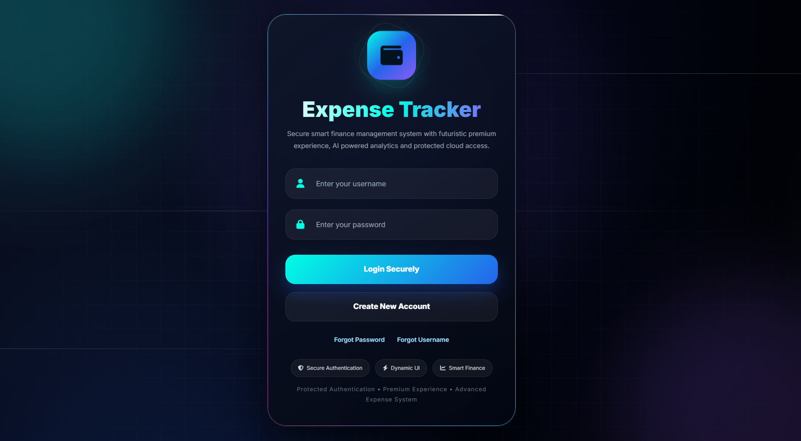
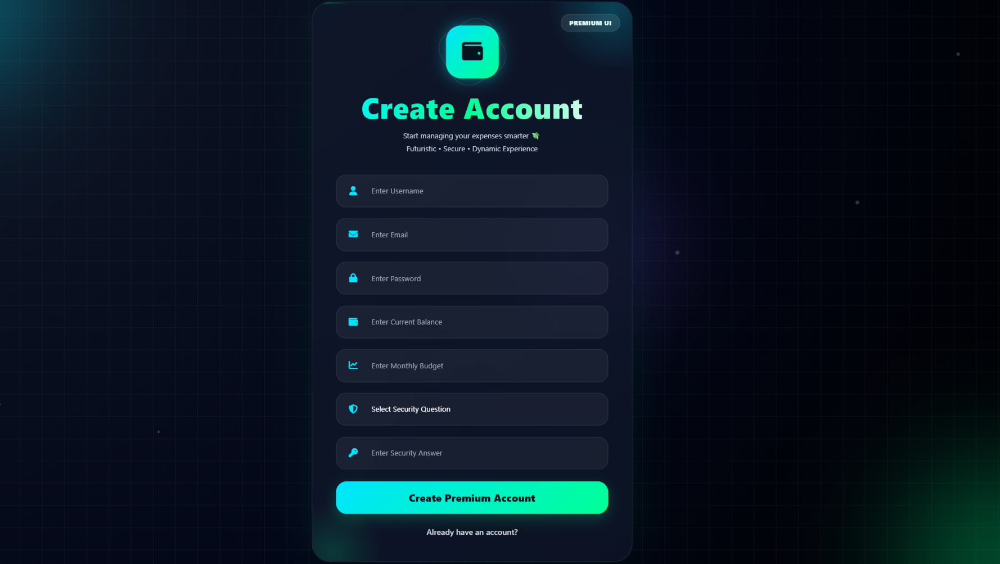
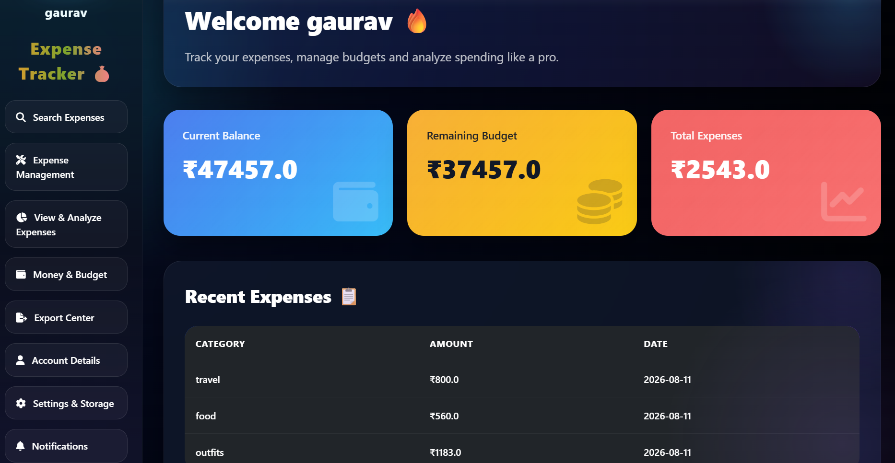
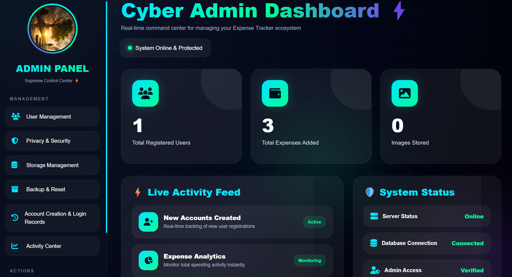

# SpendWise — Expense Tracker Web App

A modern Flask-based Expense Tracker Web Application designed to help users manage expenses, budgets, income, and financial activity through a secure and responsive interface.

SpendWise also provides **data-driven analytics and Machine Learning features** for spending forecasting, anomaly detection, and personalized financial insights.

---

## Features

### User Authentication & Security

* User Registration and Login
* Secure Password Hashing
* OTP Verification
* Two-Step Verification
* Forgot Password
* Forgot Username
* Security Question and Answer
* Login Activity Monitoring

### Expense Management

* Add Expenses
* Edit Expenses
* Delete Expenses
* Expense Categories
* Expense Date Tracking
* Expense Image Upload
* Expense Memory Gallery
* Search Expenses
* Filter Expenses by Date
* Sort Expenses by Amount
* Monthly Expense Reports

### Budget & Income Management

* Monthly Budget Management
* Income Tracking
* Budget Balance Monitoring
* Budget Warnings
* Savings-Oriented Financial Insights

### Analytics & Machine Learning

* Analytics Dashboard
* Category-Wise Spending Analysis
* Expense Charts
* Expense Statistics
* Monthly Spending Analysis
* 30-Day Expense Forecasting
* Machine Learning Based Spending Predictions
* Unusual Expense Detection
* Personalized AI Expense Insights
* Data-Driven Savings Recommendations

### Admin Panel

* Admin Authentication
* User Management
* User Deletion
* Application Management
* Application Reset and Backup Features

### Additional Features

* Profile Picture Upload
* Notification Settings
* CSV Export
* Excel Export
* Responsive UI
* Dark Futuristic Design
* Render Deployment Support

---

## AI & Machine Learning

SpendWise uses free, local Machine Learning techniques to analyse historical expense data without requiring a paid AI API.

### Random Forest Regression

Random Forest Regression is used to analyse historical spending patterns and generate a **30-day future spending forecast**.

The forecasting model considers features such as:

* Day of Week
* Day of Month
* Month
* Previous-Day Spending
* 3-Day Rolling Spending
* 7-Day Rolling Spending

### Isolation Forest

Isolation Forest is used for **unusual expense detection**.

It analyses transaction characteristics such as:

* Expense Amount
* Expense Category
* Date-Based Features

The system identifies transactions that differ significantly from the user's normal spending behaviour.

### Personalized AI Expense Insights

SpendWise combines:

* Historical expense patterns
* Category-wise spending
* Recent spending trends
* Machine Learning forecasts
* Anomaly detection results
* Budget information

to generate personalized financial recommendations and savings-oriented insights.

> The AI insight system is data-driven and works locally without requiring a paid OpenAI API or external AI service.

---

## Technology Stack

### Backend

* Python
* Flask
* Flask-SQLAlchemy
* SQLAlchemy
* Flask-Mail

### Machine Learning & Data Analysis

* Scikit-learn
* Pandas
* NumPy

### Frontend

* HTML5
* CSS3
* JavaScript
* Bootstrap 5
* Chart.js

### Database

* SQLite
* PostgreSQL support for deployment

### Other Technologies

* Matplotlib
* Pillow
* OpenPyXL
* FPDF
* Gunicorn

### Deployment

* Render

---

## Project Structure

```text
ExpenseTrackerWebApp/
│
├── app.py
├── requirements.txt
│
├── ai/
│   ├── __init__.py
│   └── ai_service.py
│
├── ml/
│   ├── __init__.py
│   ├── anomaly_detection.py
│   ├── feature_engineering.py
│   └── forecasting.py
│
├── templates/
│   ├── ai_insights.html
│   ├── expense_predictions.html
│   └── ...
│
├── static/
│   ├── uploads/
│   └── ...
│
└── Screenshots/
    ├── login.png
    ├── signup.png
    ├── dashboard.png
    └── admin.png
```

---

## Installation

### 1. Clone the Repository

```bash
git clone https://github.com/gauravmittal9760/expense-tracker-webapp.git
```

### 2. Go Into the Project Folder

```bash
cd expense-tracker-webapp
```

### 3. Create a Virtual Environment

```bash
python -m venv venv
```

### 4. Activate the Virtual Environment

#### Windows

```bash
venv\Scripts\activate
```

### 5. Install Dependencies

```bash
pip install -r requirements.txt
```

### 6. Run the Application

```bash
python app.py
```

The application will then be available through the local Flask server.

---

## Machine Learning Requirements

For reliable ML forecasting, the application requires sufficient historical expense data.

The forecasting system recommends maintaining expense records across multiple dates so that meaningful spending patterns can be identified.

The anomaly detection system can analyse recorded transactions and identify potentially unusual spending behaviour.

---

## Screenshots

### Login Page



### Signup Page



### Dashboard



### Admin Panel



---

## Deployment

SpendWise can be deployed using **Render** with Gunicorn.

The application supports production deployment using the dependencies specified in `requirements.txt`.

---

## Future Scope

Possible future improvements include:

* More advanced time-series forecasting
* Improved personalized financial recommendations
* Additional ML models
* Automatic expense categorization
* More advanced anomaly analysis
* Financial goal prediction
* Mobile application
* Improved notification and reminder system
* Advanced financial dashboards

---

## Project Author

**Gaurav Mittal**

B.Tech — Computer Science & Engineering

---

## Project

**SpendWise — Expense Tracker Web Application**

A major project focused on expense management, financial analytics, and Machine Learning based spending insights.
